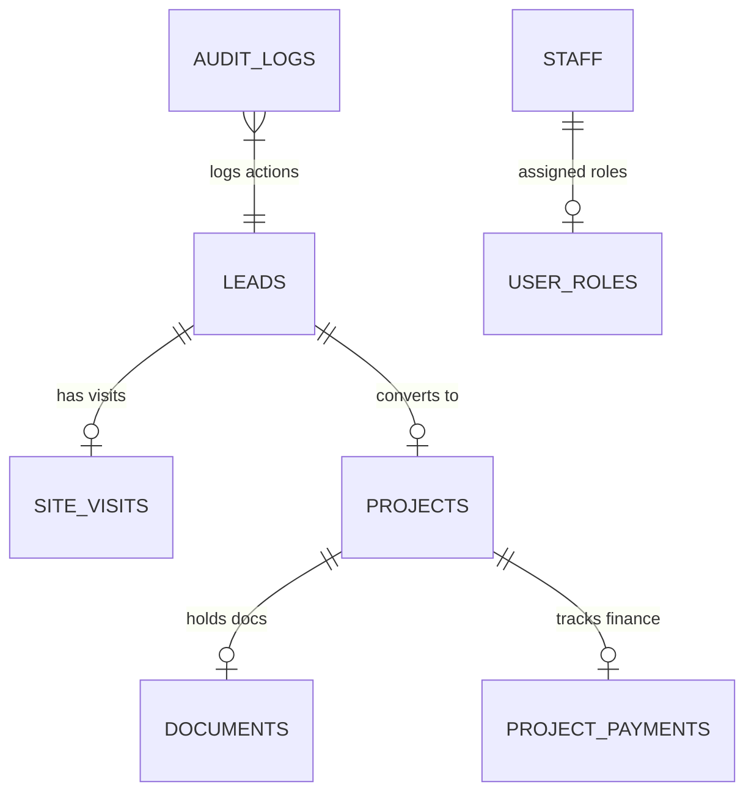

# Mayukh Solar CRM & Operations System Design

This document details the architectural layout, database models, business workflows, and technical design patterns for the **Mayukh Solar CRM & Operations Portal**.

---

## 1. Core Technology Stack
- **Frontend Framework**: React (TypeScript) + Vite
- **UI Library**: Shadcn UI (Radix Primitives) + TailwindCSS
- **Iconography**: Lucide React
- **Backend & Database**: Supabase (PostgreSQL)
- **State Management & Routing**: React Router DOM (v6) + Supabase Auth Session
- **Integrations**: Twilio / WhatsApp Gateway APIs, Discom Consumer APIs

---

## 2. Database Architecture & Schema

The application uses PostgreSQL schemas defined within Supabase. Below are the key tables and relationships:

### Key Tables

#### 1. `leads`
Tracks customer inquiries and status transitions from creation to conversion.
- `id` (UUID, PK)
- `customer_name` (Text)
- `mobile` (Text, Unique)
- `email` (Text)
- `address`, `village_city`, `district`, `state` (Text)
- `status` (Enum: `new`, `visit_created`, `visited`, `follow_up`, `interested`, `not_interested`, `cancelled`, `final`, `quotation_sent`, `quotation_accepted`, `quotation_rejected`)
- `k_number` (Text, 12-digit Discom ID)
- `kw_interest` (Numeric)
- `plant_details` (JSONB: technical assessment options)
- `quotation_details` (JSONB: quote pricing, panel quantities, brands)
- `quotation_response_at` (Timestamp)
- `quotation_response_message` (Text)

#### 2. `projects` (Deals)
Represents converted deals in active project operations.
- `id` (UUID, PK)
- `lead_id` (UUID, FK -> `leads`)
- `project_code` (Text, Unique - e.g. `MS-P-XXXXXX`)
- `status` (Enum: `pending_documents`, `pending_operator_review`, `assigned_to_welder`, `structure_ready`, `assigned_to_electrician`, `net_metering_pending`, `net_meter_installed`, `completed`, `cancelled`)
- `payment_type` (Text: `cash` | `loan`)
- `loan_bank` (Text)
- `final_amount` (Numeric)
- `assigned_welder_id` (UUID, FK -> `staff`)
- `assigned_electrician_id` (UUID, FK -> `staff`)
- `net_metering_file_number` (Text)
- `net_meter_number` (Text)
- `inspection_date` (Date)

#### 3. `project_payments`
Records incoming customer margin payments and bank loan disbursals.
- `id` (UUID, PK)
- `project_id` (UUID, FK -> `projects`)
- `source` (Text: `customer` | `bank`)
- `amount` (Numeric)
- `payment_date` (Date)
- `payment_mode` (Text: `cash` | `bank_transfer` | `cheque` | `upi` | `other`)
- `reference_number` (Text)
- `status` (Text: `pending` | `completed` | `rejected`)
- `notes` (Text)

#### 4. `staff` & `user_roles`
User directory and permission tables.
- **Roles**: `admin`, `telecaller`, `sales_person`, `worker`, `operator`, `welder`, `electrician`.

---

## 3. Core Business Workflows

### Phase 1: Lead Intake & Discom Sync
1. Lead is created manually or imported.
2. Staff triggers **Discom Sync** via the customer's 12-digit `k_number`.
3. An Edge Function queries the Discom API and returns customer credentials, address, and sanctioned load.

### Phase 2: Site Assessment & Quotation
1. A salesperson conducts a site visit, entering roof coordinates, shadow assessments, and proposed plant specifications (KW size, inverter and panel brands).
2. The quotation is generated as a PDF and sent directly to the client's mobile via **WhatsApp API integration**.

### Phase 3: Auto-Acceptance Webhook
1. When a client replies to the quotation over WhatsApp, the response hits a Supabase Edge Function (`whatsapp-webhook`).
2. The webhook parses keywords:
   - **Acceptance** ("confirm", "yes", "accept", "ok") -> Updates status to `quotation_accepted` and logs timestamps.
   - **Rejection** ("no", "reject", "cancel") -> Updates status to `quotation_rejected`.
3. The response details are written directly to the lead's timeline.

### Phase 4: Convert to Deal & Payments
1. Under the `quotation_accepted` banner, staff clicks **Convert to Deal**.
2. All technical details, panel choices, and final amounts are pre-filled into the project creation screen.
3. Once converted, payments can be tracked:
   - For **Cash** deals, payments are recorded from the client.
   - For **Loan** deals, payments are split between client margin money and bank disbursals.

### Phase 5: Operations & Material Dispatch
1. The project moves through stages:
   - Welder allocation -> Structure Ready.
   - Material Dispatch checklist (rails, cables, fasteners, panels).
   - Electrician allocation -> Wiring completed.
   - Net metering file upload & inspector verification.
   - Final status updated to `completed`.

---

## 4. Key Integrations & Automation

### 1. WhatsApp Webhook (`/supabase/functions/whatsapp-webhook`)
An Edge Function configured with regex triggers to clean incoming phone numbers, scan for quotation identifiers (`MS-Q-XXXXXX`), and execute secure database updates bypassing default RLS constraints using service role credentials.

### 2. Discom Lookup (`/supabase/functions/consumer-lookup`)
Uses reverse discom mapping to load consumer records instantly based on regional discom offices.

---

## 5. Security & Access Control
- **RLS Policies**: Restrict field staff to assigned projects, allow read-only access to sales personnel for interested leads, and grant full access only to administrator roles.
- **Auditing**: All key state mutations (lead assignment, status changes, document decisions, and payment additions) are logged into the `audit_logs` table for administrative review.
