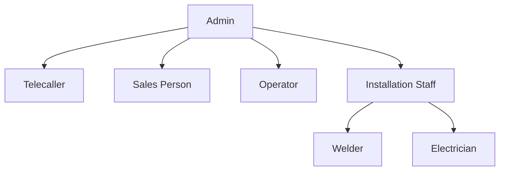
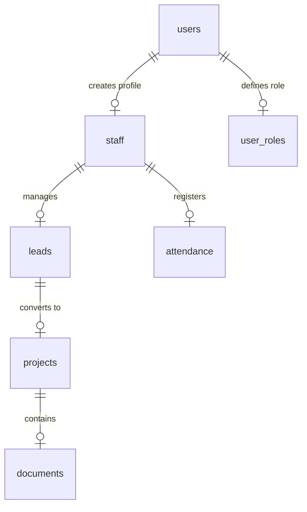

# Business Requirements Document (BRD)
## Mayukh Solar CRM System

---

## 1. Document Control
*   **Project Name:** Mayukh Solar CRM
*   **Version:** 1.0.0
*   **Status:** Approved
*   **Author:** Antigravity AI Pair Programmer
*   **Date:** July 3, 2026

---

## 2. Project Overview & Business Goals
The **Mayukh Solar CRM** is a role-based business management system designed to streamline customer acquisition, project dispatching, field worker tracking, and operations management for a solar installation business. 

### Core Business Objectives:
*   **Centralize Lead Intake:** Track leads from initial contact through follow-up, quotation import, and final conversion.
*   **Streamline Project Operations:** Manage solar installation stages (operator assignment, document verification, material dispatch, site work, billing).
*   **Optimize Field Attendance:** Enforce geographical geofencing and GPS validation for sales team attendance and site visits.
*   **Automate Task & Staff Management:** Delegate tasks, track worker performance, calculate monthly salaries, and manage system access.

---

## 3. User Roles & Access Hierarchy
The application uses strict Role-Based Access Control (RBAC) powered by Supabase.

| Role | Target User | Key Responsibilities | Access Level |
| :--- | :--- | :--- | :--- |
| **Admin** | Business Owner / Manager | Manages staff, assigns roles, monitors company metrics, overrides attendance, imports quotations. | Full read/write access to all tables. |
| **Telecaller** | Customer Support Representative | Call logs, leads management, scheduling follow-ups. | Read/write access on assigned Leads and Tasks. |
| **Sales Person** | Field Sales Consultant | Registers leads on-site, punches attendance with location verification, conducts site visits. | Access to own Leads, Attendance, and Tasks. |
| **Operator** | Dispatcher / Project Coordinator | Oversees logistics, assigns installation crews, validates documents, dispatches inventory. | Read/write on Projects, Materials, and Tasks. |
| **Welder / Electrician** | Field Installation Technician | Installs solar structures, completes wiring, uploads installation photos, updates job status. | Read-only on Projects; edit status of assigned tasks. |

---

## 4. Key Functional Modules

### 4.1. Authentication & Signup Flow
*   **Standard Sign-in:** Secure login via email and password with forced password change on first-time usage.
*   **Google OAuth Sign-in:** Modern authentication using Google accounts.
*   **Security Gate (Admin Approval):** 
    *   All new signups are marked as **inactive** (`is_active = false`) and do not receive a default role.
    *   Users are blocked by a **Pending Approval** page upon logging in.
    *   Admins must approve the user, assign a role, and activate the account from the **Staff Management** panel.

### 4.2. Lead Management (Leads Cockpit)
*   **Intake Forms:** Create leads with customer name, phone number, address, monthly electricity bill, and solar requirements.
*   **Stage Transitions:**
    *   `New` $\rightarrow$ `Follow Up` $\rightarrow$ `Finalization` $\rightarrow$ `Cancelled`.
*   **Quotation Import:** Import quotation details (CSV/Excel format) including items, amounts, and tax breakdowns.
*   **Leads Bin:** Recycle bin for cancelled or deleted leads to prevent accidental data loss.

### 4.3. Project Pipeline (Operations)
Once a lead transitions to `Finalization`, a project is spawned.
*   **Stage Gates:**
    1.  **Document Verification:** Upload and approve Aadhaar, electricity bill, and photo.
    2.  **Operator Assignment:** Assign an operations head.
    3.  **Material Dispatch:** Log structural frames, solar panels, and inverters dispatched to the site.
    4.  **Installation:** Welder and Electrician perform construction and electrical setup.
    5.  **Billing & Completion:** Mark project completed, register payment type (Cash or Loan), and finalize billing.

### 4.4. Attendance & Field Tracking
*   **Geofenced Punch-in:** Sales team can only log start-of-day when within the geofenced coordinates of the office or site.
*   **Field Visit Logs:** Start and stop tracking for physical customer visits, including target geofence coordinates and distance calculations.
*   **Special Punch-out:** Request manual overrides from the admin if GPS validation fails.

### 4.5. Task Board (Task Management)
*   Kanban/list interface to create, assign, and track action items.
*   Priority levels (`high`, `medium`, `low`) and deadline tracking.

### 4.6. Staff Management & Salary Profiles
*   **Staff Profiles:** View contact lists, update credentials, reset passwords to temporary 6-digit PINs.
*   **Salary Profiles:** Define base salary, allowance per field visit, and calculate monthly payroll based on recorded attendance.

---

## 5. System Data Model
The database is structured in Supabase with the following primary schema relationships:

### Table Definitions (Summarized)
1.  **`auth.users`**: Supabase internal user credentials.
2.  **`public.staff`**: Extends user profiles (Name, Mobile, Email, Active Status, Password Reset states).
3.  **`public.user_roles`**: Links users to `app_role` enum (`admin`, `telecaller`, `sales_person`, `operator`, `welder`, `electrician`).
4.  **`public.leads`**: Stores customer intake and status details.
5.  **`public.projects`**: Stores operations progress, payment metrics, and assignment details.
6.  **`public.attendance`**: Holds daily clock-in records, GPS logs, and target visit approvals.
7.  **`public.tasks`**: Stores tasks with assignment logs.

---

## 6. Security & RLS Policy Matrix
To protect sensitive commercial customer data, Row Level Security (RLS) is strictly enforced:
*   **Admins:** Bypasses restriction policies (`service_role` and custom policies grant full access).
*   **Staff Profiles:** Restricts updates to own records, except for admins.
*   **Customer Leads:** Telecallers and Sales Persons can only view/edit records that are explicitly assigned to them.
*   **Project Documents:** Operations operators and technicians can view documents matching assigned projects.
